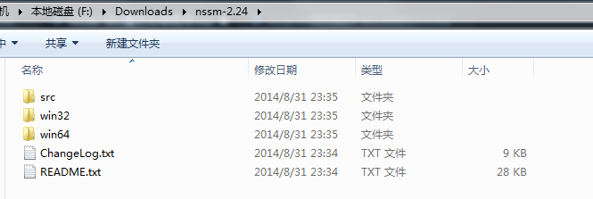
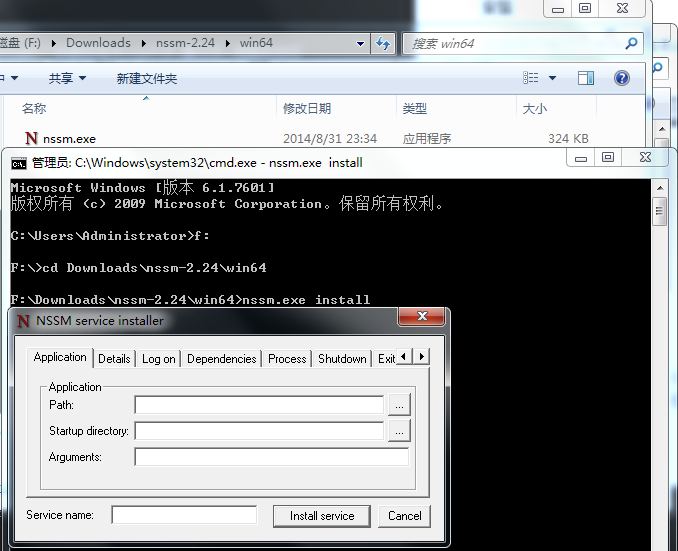

## 介绍

[NSSM(the Non-Sucking Service Manager)](http://www.nssm.cc/usage)是Windows环境下一款***免安装***的服务管理软件，它可以将应用封装成服务，使之像windows服务可以设置自动启动等。并且可以监控程序运行状态，程序异常中断后自动启动，实现守护进程的功能。不仅支持图形界面操作，也完全支持命令行设置。

<!--more-->

## 使用
只能在cmd或powershell中使用,无法直接运行nssm.exe启动.

#### 安装

在[官网下载页](https://nssm.cc/download)下载最新版本zip文件,解压后,根据系统在对应文件夹找到nssm.exe即可使用.



#### 图形界面

使用图形界面,需要在cmd或powershell中进入到nssm.exe所在目录,执行nssm.exe install即可打开图形操作界面.填入各项必要信息之后点击"install service"即可成功安装服务.服务安装成功后,打开任务管理器,在服务中找到"Service name"对应的名称启动,即可启动或停止服务.



Application: 将应用程序做为服务安装
- Path: 应用程序所在路径
- Startup directory: 应用程序所在目录
- Arguments: 应用程序启动时所需要的参数
- Service name: 应用程序作为服务启动时的服务名称

> Tips:  install service安装时错误可能是第三方安全软件将系统修改阻止,可在安装前关闭安全软件,安装成功后重新打开.


#### NSSM命令

通过图形界面(GUI)安装服务: nssm install [\<servicename\>]

通过图形界面(GUI)修改服务: nssm edit \<servicename\>

不通过图形界面(GUI)安装服务: nssm install \<servicename\> \<app\> [\<args\>...]
``` bat
// 安装应用为服务
nssm install frpserver "c:\Program Files\frp\frpc.exe"
// 设置需设为服务应用所在目录
nssm set frpserver AppDirectory "c:\Program Files\frp\"
// 设置启动服务所需要的参数
nssm set frpserver AppParameters "-c frps.ini"
```

获取配置信息: nssm get \<servicename\> \<parameter\> [subparameter]

设置服务信息: nssm set \<servicename\> \<parameter\> [subparameter] value

重置配置: nssm reset \<servicename\> \<parameter\> [subparameter]

删除服务: nssm remove \<servicename\> [confirm]

启动服务: nssm start \<servicename\>

暂停服务: nssm pause \<servicename\>

继续服务: nssm continue \<servicename\>

停止服务: nssm stop \<servicename\>

重启服务: nssm restart \<servicename\>

查看服务状态: nssm status \<servicename\>

手动轮转日志文件: nssm rotate \<servicename\>