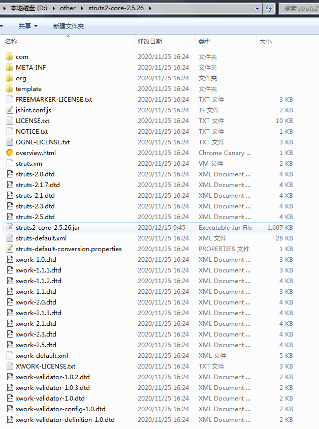

## 介绍

在开发过程中,有时需要对第三方jar包中的代码进行修改以符合项目中的需求,因此需要对jar包进行拆解,将.class反编译为.java文件,修改好代码之后将.java编译为.class,最后再重新打成jar包.

<!--more-->

##  操作过程

1. 拆包: 直接使用解压缩软件将jar包解压
2. 获取源码: 
    * 反编译: 使用工具将.class反编译为.java文件
    * 源码: 对部分官方提供源码的jar包,可直接在官方提供的渠道获取源代码
3. 编译: 使用javac命令将.java文件编译为.class文件(注:此处可以直接使用解包前的jar作为编译的依赖)
4. 打包: 使用jar命令将编译好的整个文件进行打包

## 实例

#### 需求说明

修改struts2-core-2.5.26.jar中的InitOperations.class.

1. 拆包:
   
    将struts2-core-2.5.26.jar通过7zip或其它缩软件进行解压操作

    

2. 获取源码:

    struts官方提供了源代码,所以不需要对InitOperations.class进行反编译.

3. 编译:
    
    通过javac将InitOperations.java编译为InitOperations.class,直接使用struts2-core-2.5.26.jar作为编译时的依赖

    * -encoding utf8 表示使用utf8字符编码
    * -source 1.7  提供与指定发行版兼容的jdk版本
    * -target 1.7  生成的jdk版本
    * -cp 即-classpath,指定需要依赖的jar包(多jar依赖时,win下使用 ; 分隔,linux使用 : 分隔)
    * 最后为需要编译的文件名

    ``` cmd
    javac -encoding utf8 -source 1.7 -target 1.7 -cp D:\other\struts2-core-2.5.26.jar;D:\other\servlet-api-2.5.jar InitOperations.java
    ```

4. 打包:
   
   回到拆包的根目录(此处即D:\other\struts2-core-2.5.26),执行jar命令进行打包

   * -c 表示创建新档案
   * -v 表示在标准输出中生成详细输出,即在终端中打印打包过程
   * -f struts2-core-2.5.26.jar 表示指定生成档案的文件名
   * . 表示将当前目录下的所有文件打入包中

   ``` cmd
   jar -cvf struts2-core-2.5.26.jar .
   ```
